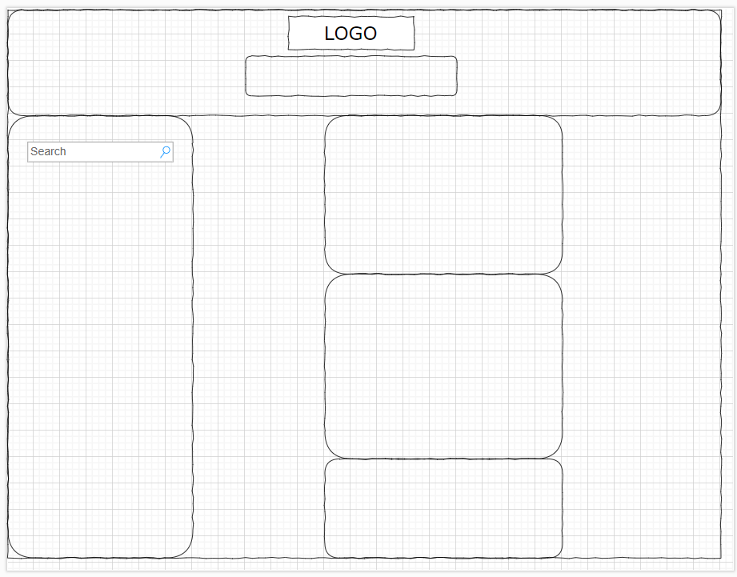

# Weather-App

## Description

The motivation behind this project was to solidify my knowledge of server-side APIs. I was to build a weather-app from the provided code using my knowledge of Javascript, HTML, CSS, and server-side APIs. Additionaly, this challenge introduced me to concepts regarding API requests and authorization. Using the Open Weather API, jQuery, Bootstrap, and Dayjs was also crucial for completing this project. 

Link to deployed application [here](https://saduhub.github.io/Weather-Forecast-App/)

Screenshot of project:

Screenshot of project wireframe:

## Installation

N/A

## Usage

N/A

## Credits

N/A

## License

Please refer to the LICENSE in the repo.